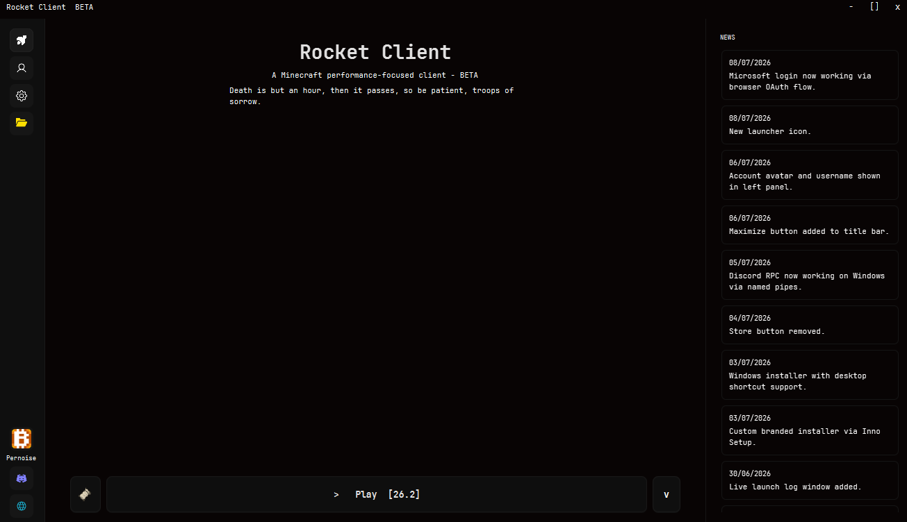
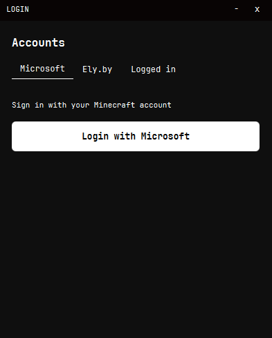
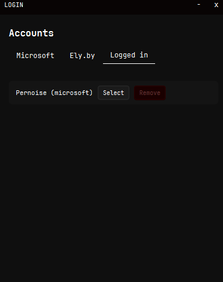
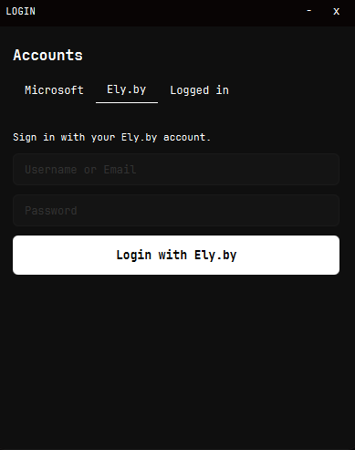
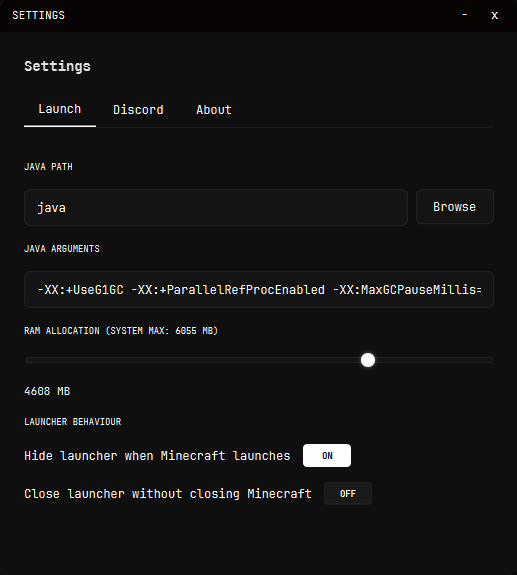

# Hi, I'm Pernoise

I build tools for Minecraft. Right now most of my time goes into **Rocket Client**, a custom launcher I'm developing from scratch in Java and JavaFX.

## Rocket Client

Rocket Client is a Minecraft launcher built around a simple idea: a clean, dark, no clutter interface with the features that actually matter. Fabric and Forge support, automatic Java version detection and download per Minecraft version, account management for Microsoft and Ely.by, and a UI that doesn't get in the way.

### Features

- Fabric and Forge support across a wide range of Minecraft versions
- Automatic Java runtime detection and download, matched to whatever version you're launching
- Microsoft and Ely.by account login
- Custom dark theme with rounded UI elements, built to feel consistent across every window
- Discord Rich Presence integration
- System tray support so the launcher can stay out of your way while you play

### Screenshots

<table>
  <tr>
    <td> Main launcher window</td>
    <td> Login screen</td>
  </tr>
  <tr>
    <td> Account management</td>
    <td> Ely.by login</td>
  </tr>
  <tr>
    <td> Settings</td>
    <td> About page</td>
  </tr>
</table>

### Built with

Java, JavaFX, Gradle

### Links

- Repository: [Rocket-client](https://github.com/Pernoise/Rocket-client)
- Discord: [Join the server](https://discord.com/invite/urHfdFdsbh)
- Website: [rocketclient](https://rocketclient.rocketclient.abrdns.com)

## What I'm doing now

Actively developing Rocket Client, working through Fabric and Forge compatibility across more Minecraft versions, refining the UI, and packaging proper installers for Windows and Linux.

## Reach me

Feel free to open an issue on the repo above or drop into the Discord server if you want to talk about the project, report a bug, or suggest a feature.
